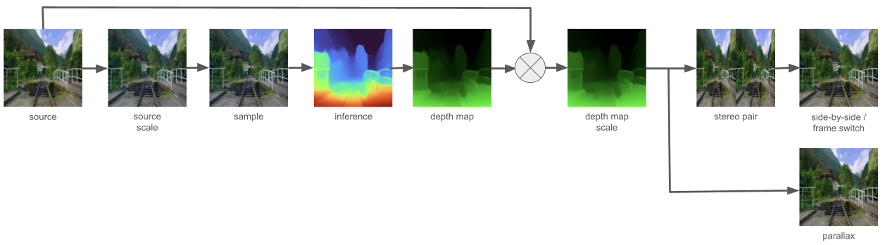

<h3>Kinematoscope</h3>
<ul>
  2D to 3D realtime video conversion using monocular depth estimation.
</ul>

<h4>Processing pipeline</h4>
<ul>
  Key processing steps of the conversion process:
  
  
  Depth map to source resolution scaling is embedded into stereo pair / parallax nodes.
</ul>

<h4>Output</h4>
<ul>
  <li><strong><i>parallax</i></strong>
     Renders parallax effect.
  </li>
  

  
Targets browser. 3D illusion can be observed by moving rendered image around with a mouse.

  
   
  
  <li><strong><i>side by side</i></strong>
     Displays side by side stereo image pair "as-is".
  </li>
  

  
Targets devices capable of display side by side stereo image in 3D, like AR/VR glasses or glass free 3D displays.

  
3D illusion can also be observed without dedicated hardware using <a href="https://puzzlewocky.com/optical-illusions/3d-illusions/cross-view-stereograms/">cross eyed</a> viewing method.

  
  > [!TIP]
  > Optimal 3D illusion requires adjustment of pipeline options for cross eyed and hardware assisted viewing.

   
  
  <li><strong><i>frame switching</i></strong>
     Switches between left / right frame of stereo image pair.
  </li>
  

  
Targets 3D active shutter glasses.

  > [!NOTE]
  > !! experimental !!

  
3D illusion observed with tested active shutter glasses is unstable. Effect fades in and out of 3D sync.
  Manufacturer provided application does not exhibit such behaviour which points toward synchronisation issues between:
    <ul>
      <li>active shutter glasses eye switching.</li>
      <li>left / right image render.</li>
    </ul>
  

  
Although testes glasses are serial port controlled, control protocol is proprietary excluding potential use of <a href="https://developer.mozilla.org/en-US/docs/Web/API/Web_Serial_API">Serial WebAPI</a>, in supporting browsers, to improve synchronisation.

</ul>